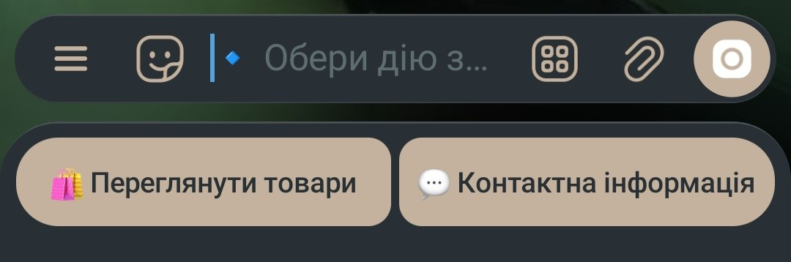
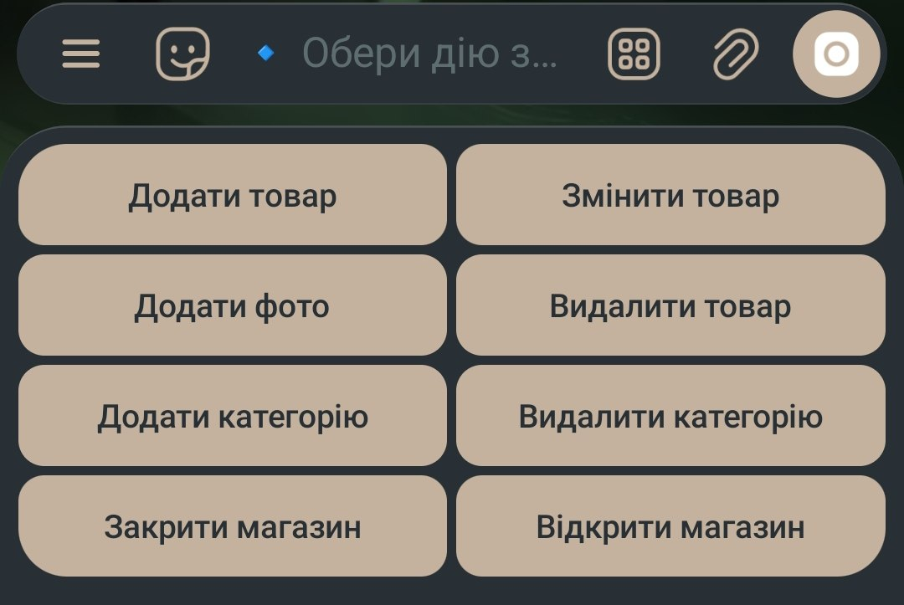
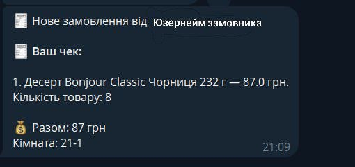

# Duikt Telegram Shop Bot
Телеграм бот для зручнішого управління онлайн магазином із зручним управлінням для адмінів магазину. Додаток виконаний на замовлення.

## Скріншоти додатку
1. Головне меню для користувачів


2. Головне меню для адмінів


3. Вигляд чеку для адмінів



## Стек технологій
1. **Функціонал** - Python + aiogram 3.13
2. **База данних** - SQLite

## Функціонал
1. Для користувачів
  - Перегляд товарів по категоріях
  - Створення та редагування замовлень із переглядом чеків
  - Можливість вибору способу оплати та доставки
2. Для адмінів
  - Зручна адмін панель 
  - Додавання товарів
  - Видалення товарів
  - Зміна фото товару
  - Додавання категорії товарів
  - Видалення категорії товарів
  - Зміна інформації про товар
  - Система відкриття та закриття магазину

## Локальний запуск
1. Клонувати репозиторій 
```bash
git clone https://github.com/daniyilamelin/DUIKT_Shop
```
2. В папці проекту встановити залежності
```bash
pip install -r requirements.txt
```
3. Створити файл .env та заповнити його совїми даними
```python
TOKEN=
ADMIN_ID=
DB_PATH=
```
4. Запустити проект
```bash
python main.py
```
